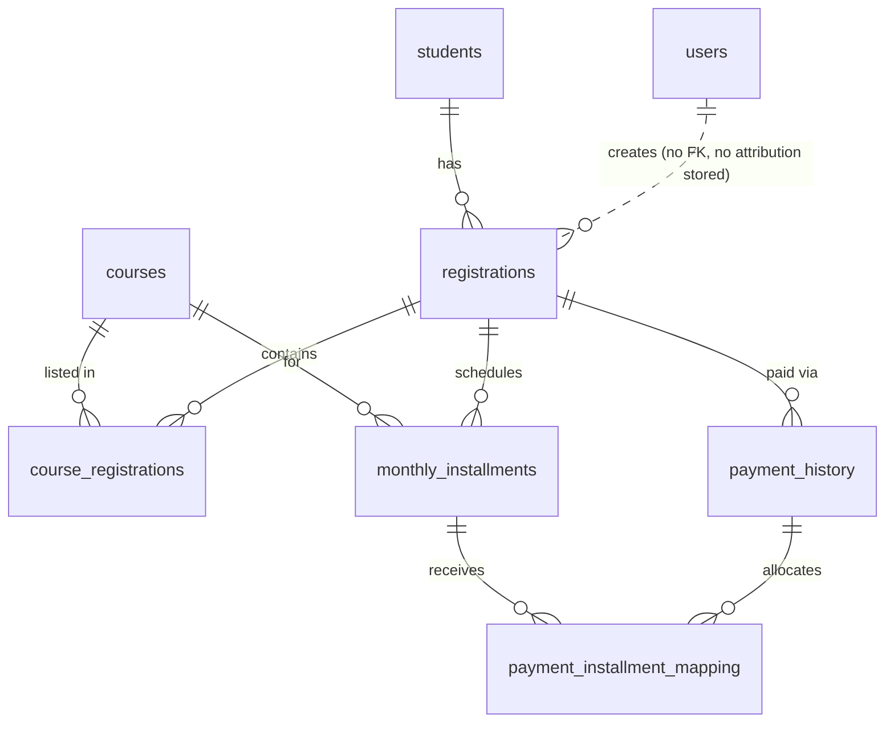

# 02 — Data Model & Data Flow

> The schema is **not** in the repository. This document reconstructs it from the SQL in the seven serverless functions. Column lists are complete only insofar as the code references them; there may be additional columns the code never touches. **Confirming the live schema is the first task of any redesign.**

## Reconstructed entities

### `users` — staff/admin accounts
`id`, `username`, `password_hash` (bcrypt), `user_type` (`'admin'` | `'student'`), `is_active`, `failed_attempts`, `locked_until`, `last_login`
Source: [auth.js:42, 91, 107](../netlify/functions/auth.js#L42).
Note: `user_type` includes `'student'` ([login.html:177](../login.html#L177)) but there is **no student self-service** anywhere — students never actually log in. This is a vestigial concept.

### `students` — the person
`id`, `full_name`, `phone_number` (treated as a natural key), `email`, `date_of_birth`, `address`, `created_at`, `updated_at`
Source: [registrations.js:38-61](../netlify/functions/registrations.js#L38-L61).

### `courses` — catalogue
`id`, `name`, `duration` (free text, e.g. "6 Months"), `full_price`, `monthly_price`, `monthly_installments` (default 12), `is_active`
Source: [courses.js:23](../netlify/functions/courses.js#L23), [registrations.js:86-92](../netlify/functions/registrations.js#L86-L92).
Note: `monthly_price` appears to be the **total** cost under the monthly plan, and per-month = `monthly_price / monthly_installments` ([course-registration.html:523](../course-registration.html#L523)).

### `registrations` — an enrolment event (one receipt)
`id`, `receipt_no`, `student_id` (FK→students), `total_amount`, `admission_fees`, `discount_amount`, `paid_amount`, `due_amount`, `payment_method`, `payment_status` (`PARTIAL`|`COMPLETED`), `registration_date`
Source: [registrations.js:65-72](../netlify/functions/registrations.js#L65-L72), [record-payment.js:156-166](../netlify/functions/record-payment.js#L156-L166).

### `course_registrations` — courses within a registration (M:N)
`id`, `registration_id` (FK), `course_id` (FK), `payment_plan` (`full`|`monthly`), `course_fee`
Source: [registrations.js:77-81](../netlify/functions/registrations.js#L77-L81).

### `monthly_installments` — the payment schedule
`id`, `registration_id` (FK), `course_id` (FK), `month_number`, `month_name` (literally `"Month 1"`), `due_date`, `installment_amount`, `paid_amount`, `payment_status` (`PENDING`|`PARTIAL`|`PAID`; `OVERDUE` derived at read time), `payment_date`, `updated_at`
Source: [registrations.js:101-113](../netlify/functions/registrations.js#L101-L113), [record-payment.js:131-145](../netlify/functions/record-payment.js#L131-L145).

### `payment_history` — the money ledger
`id`, `registration_id` (FK), `payment_amount`, `payment_method`, `payment_type` (`initial`|`installment`), `receipt_no`, `notes`, `payment_date`
Source: [registrations.js:121-127](../netlify/functions/registrations.js#L121-L127), [record-payment.js:117-120](../netlify/functions/record-payment.js#L117-L120).

### `payment_installment_mapping` — which payment covered which month
`id`, `payment_history_id` (FK), `monthly_installment_id` (FK), `amount_applied`
Source: [record-payment.js:148-151](../netlify/functions/record-payment.js#L148-L151).

## Relationship diagram

## Data flow — new registration
[course-registration.html:674-762](../course-registration.html#L674-L762) → [registrations.js:31-140](../netlify/functions/registrations.js#L31-L140)

1. Browser computes `total_amount`, `discount_amount`, `paid_amount`, `due_amount` **client-side** and posts them.
2. Server upserts `students` **by `phone_number`** (updates the row if the phone already exists).
3. Server inserts `registrations` using the browser-supplied money values verbatim.
4. For each course → insert `course_registrations`; if plan is `monthly`, generate N `monthly_installments` (N = `courses.monthly_installments`), each `installment_amount = course_fee / N`, due dates one month apart.
5. If `paid_amount > 0`, insert one `payment_history` row (`type = initial`).
6. Commit; return `receipt_no`.

## Data flow — recording a later payment
[admin.html addPayment/processMonthlyPayment](../admin.html#L1759) → [record-payment.js:31-211](../netlify/functions/record-payment.js#L31-L211)

- Staff select specific month cards; the UI sums their amounts and posts `monthly_payments: [{course_id, month_ids[], amount}]`.
- Server validates the breakdown sums to `payment_amount`, inserts a `payment_history` row, then **splits each line evenly across its months** (`amount / month_ids.length`, [record-payment.js:127](../netlify/functions/record-payment.js#L127)) and writes `payment_installment_mapping` rows.
- Server bumps `registrations.paid_amount`/`due_amount`/`payment_status`.
- A **second, separate** endpoint `update-payment.js` also bumps `registrations.paid_amount` but touches **no** `monthly_installments` — a divergent path.

---

## Strengths
- Properly normalised core (no repeating groups; M:N handled with a join table).
- A real **ledger** (`payment_history`) plus **allocation** table (`payment_installment_mapping`) — this is exactly the right shape for auditable billing, and better than most systems at this scale.
- Account-lockout fields on `users` (`failed_attempts`, `locked_until`) show security awareness at the data level.

## Weaknesses
- **Two sources of truth for "amount paid":** `registrations.paid_amount` and `SUM(monthly_installments.paid_amount)`. `update-payment.js` updates the former without the latter, so they drift. There is no reconciliation.
- **Money as floating point.** Amounts are `parseInt`/`parseFloat` in JS and summed in SQL then `parseInt`-ed ([dashboard-stats.js:48](../netlify/functions/dashboard-stats.js#L48)). Currency should never be float/int-truncated; paise are silently dropped.
- **`phone_number` used as a natural key** for upsert but almost certainly not `UNIQUE`-constrained in a way the app respects — two family members sharing a phone collapse into one student, and a mistyped phone overwrites a stranger's record ([registrations.js:38-52](../netlify/functions/registrations.js#L38-L52)).
- **No `created_by` / `updated_by` / audit columns.** Nothing records which staff account created a registration or recorded/deleted a payment. Attribution is impossible.
- **Derived state stored, not computed.** `payment_status`, `due_amount`, `days_overdue` are a mix of stored and computed; the stored ones go stale (e.g. a `PENDING` month past its due date is only "OVERDUE" when a specific query recomputes it, [record-payment.js:225-232](../netlify/functions/record-payment.js#L225-L232)).
- **`month_name` is `"Month 1"`**, not an actual calendar month — so a receipt can't say "March 2026" without recomputation.
- **Referential integrity is unverified and partially violated by the app:** `delete-registration.js` deletes `payment_history` and `course_registrations` but **not** `monthly_installments` or `payment_installment_mapping` (see [03](03-Backend-Audit.md)).

## Pain points
- Reconciling a student's true balance requires trusting one of two disagreeing numbers.
- Reporting is crippled: you cannot cleanly answer "how much did we collect in July" because collection lives in `payment_history` but "due" lives in two other places, and none carries clean money types.

## Opportunities
- Move to **integer minor units (paise)** for all money, or Postgres `NUMERIC`, and centralise money math server-side.
- Make **`payment_history` the single source of truth**; treat `paid_amount`/`due_amount` as *derived* (materialised views or computed on read).
- Add **audit columns** and a `student` identity that isn't the phone number (surrogate ID already exists — stop upserting on phone).
- Store real **calendar due months** and course start dates.

## Recommended direction
Adopt a schema-first workflow: export the current live schema, commit it, then evolve it through migrations toward (a) money as `NUMERIC`/integer paise, (b) a single canonical balance derived from the ledger, (c) audit/attribution columns, (d) proper unique constraints and foreign keys with `ON DELETE` rules that match the app's intent.

## Priority
**🔴 P0.** Every billing and reporting improvement is blocked until the money types and the single-source-of-truth question are resolved.
